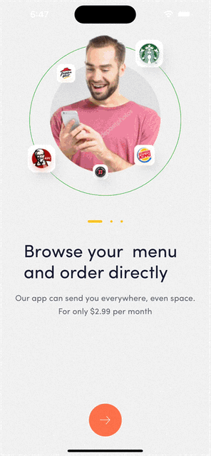

# Duolingo Clone

<!---Esses são exemplos. Veja https://shields.io para outras pessoas ou para personalizar este conjunto de escudos. Você pode querer incluir dependências, status do projeto e informações de licença aqui--->




## 💻 Prerequisites

- NodeJS
- Expo

## Built With


 
 

## 🚀 Installation

Clone repo

```
git clone https://github.com/msouzadev/food-hub.git
```

## ☕ Running

```
yarn ios
```

or

```
yarn android
```
